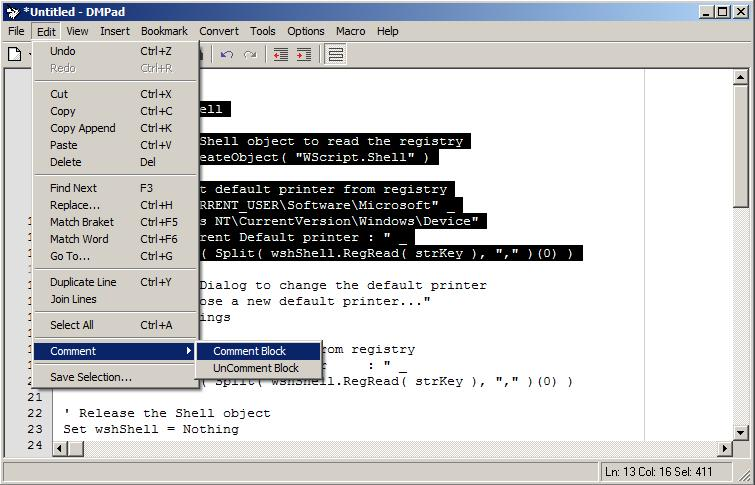

## DM Pad 1\.2 Update

### Description

DMPad 1.1 This is almost a complate clone of Notepad that I made for my self you can use it to edit text files of use it to compile code for VB.NET or C#, you can also add your own compiler files very easy and see the outputs, New updates include reading Unicode Files, lots of custom templates in the edit menu, Many new insert options, I now added a options menu to config the program, To many updates to list, so please see the project, Hope you like this update.
 
### More Info
 

             |
---                |---
**Submitted On**   |2008-11-23 12:49:30
**By**             |[dreamvb](https://github.com/Planet-Source-Code/PSCIndex/blob/master/ByAuthor/dreamvb.md)
**Level**          |Intermediate
**User Rating**    |4.7 (14 globes from 3 users)
**Compatibility**  |VB 6\.0
**Category**       |[Complete Applications](https://github.com/Planet-Source-Code/PSCIndex/blob/master/ByCategory/complete-applications__1-27.md)
**World**          |[Visual Basic](https://github.com/Planet-Source-Code/PSCIndex/blob/master/ByWorld/visual-basic.md)
**Archive File**   |[DM\_Pad\_1\_221351811232008\.zip](https://github.com/Planet-Source-Code/dreamvb-dm-pad-1-2-update__1-71234/archive/master.zip)

